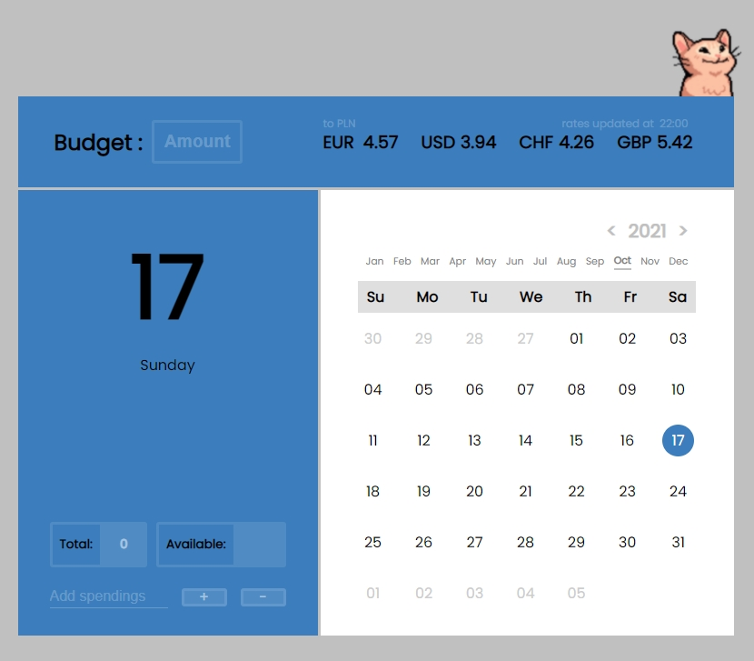

# BUDGET CALENDAR

The calendar in its current form is designed exclusively for calculating the budget for the current month. That is, any amounts from previous months or from future ones are not counted in the "**Available**:" field - (available on the day where the data is calculated from the provided budget and costs in each day of the current month)

